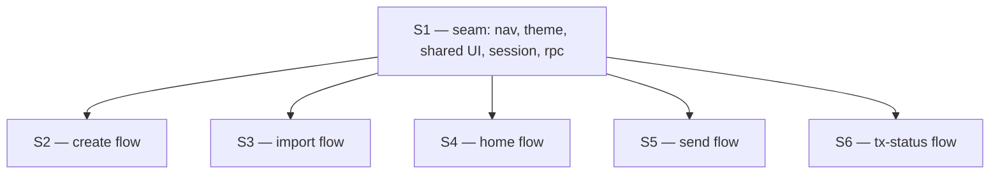

# Spec set S — sample-wallet showcase (dependency graph)

Source artifact: `Claude Design` handoff bundle (`Wallet Wireframes.html` + 5 screen JSX files + chat transcript). Direction **A · Classic** selected by the user. Target module: `sample-compose` (+ Android host `sample-app`). iOS targets dropped for this spec set (wallet-evm / wallet-rpc have no iOS targets per CLAUDE.md §1).

## Graph



## Phase table

| id | title | depends_on | parallel_group |
|----|-------|------------|----------------|
| S1 | seam — nav host, theme, shared composables, session state, RPC wiring | — | G0 (must run first, alone) |
| S2 | create-wallet flow (direction A Classic) | S1 | G1 |
| S3 | import-wallet flow | S1 | G1 |
| S4 | home — portfolio for Ethereum + Base | S1 | G1 |
| S5 | send — EIP-1559 assemble/sign/broadcast | S1 | G1 |
| S6 | tx-status — pending → confirmed | S1 | G1 |

## `/implement` invocation order

```
/implement S1
```
then, after S1 merges to `main`:
```
/implement S2 S3 S4 S5 S6
```

All G1 phases are file-disjoint (verified by grepping each spec's "Files expected to change" block — every path lives under a distinct directory, no overlap). No hot-file contention; libs.versions.toml and settings.gradle.kts are **not** touched by any phase — S1 avoids Compose-navigation libs by hand-rolling a `Route` sealed class + `Navigator`.

## Open questions to resolve before `/implement S5`

Collected across specs — these affect implementation, not decomposition, but should be closed before S5 starts:

1. **Signing API shape.** `Wallet.signTransaction(chain, transaction: Transaction): ByteArray` exists in `wallet-core`, but it takes wallet-core's `Transaction`, not `Eip1559Transaction.toSigningPayload()` bytes. Either (a) a mapping layer lives in S5's assembler, or (b) wallet-core needs a new entry point — which is out of scope for this spec set per CLAUDE.md §8. S5's spec directs the implementer to stop and raise if (a) is not viable.
2. **EthFormat surface.** S1 owns `EthFormat.kt`. S4/S5 need `weiHexToEth(decimal)`, `ethDecimalToWei(hex)`, `gweiToWei`. S1's planner/implementer must pin these signatures.
3. **RPC endpoints.** S1 hardcodes public endpoints for Ethereum + Base. Candidates: `https://ethereum-rpc.publicnode.com`, `https://base-rpc.publicnode.com`. S1 picks and documents.
4. **Mnemonic import**. `Wallet.fromMnemonicWithTrustWalletCore(mnemonic)` exists — S3 unblocked.
5. **commonTest source set**. Not wired today in sample-compose. S3 conditionally wants a `MnemonicSurfaceValidationTest.kt`. If S1 does not wire `commonTest`, S3 skips the test file and notes the gap as a follow-up.

## Notes for the orchestrator

- Every flow phase has a scope grep in its Acceptance criteria (`git diff --name-only` should be confined to its flow directory). The reviewer should enforce this rather than trust the implementer.
- No phase touches `wallet-core`, `wallet-evm`, `wallet-rpc`, `wallet-utils`, `settings.gradle.kts`, `gradle/libs.versions.toml`, or any `Chain.kt` — consistent with the "sample-only" scope agreement.
- The `sample-compose/src/iosMain/` files (`MainViewController.kt`, `MockTrustWalletCoreAdapter.kt`) become orphaned after S1 drops iOS targets. Not cleaned up in this spec set; future follow-up.
